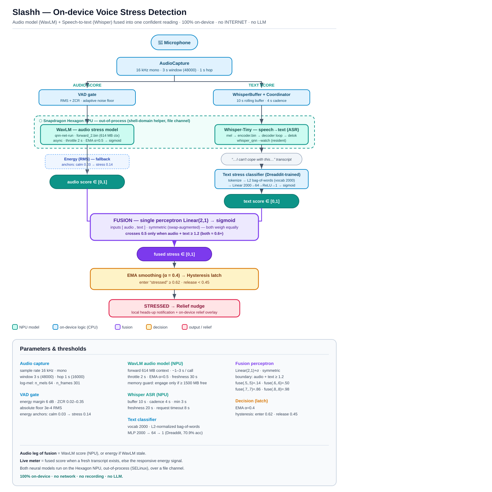

# Slashh — On-device Voice Stress Detection

**Slashh** notices when your voice is under stress and offers a calming nudge — **entirely on
your phone**, in real time, with **no network, no recording, and no LLM**. It runs **two neural
models on the Snapdragon Hexagon NPU** and fuses them into one confident reading:

- 🎙️ **WavLM** — an audio stress model that listens to *how* you speak.
- 📝 **Whisper-Tiny** — transcribes *what* you say; a trained text classifier scores the words.
- 🔗 A small **fusion perceptron** combines the two into a single stress probability.

Built for the **[Qualcomm × Meta ExecuTorch Hackathon](https://lablab.ai/ai-hackathons/qualcomm-x-meta-executorch-hackathon)** (San Francisco, June 27–28 2026) on a
**Samsung Galaxy S25 Ultra** (Snapdragon 8 Elite). Everything in the inference hot path runs
locally; the app declares **no `INTERNET` permission** and works in airplane mode.

> **Want the full story, deep-dive architecture, NPU runtime details, model training, and the
> research log of everything we tried?** → **[`docs/`](docs/index.md)**



---

## Table of contents

1. [What it does](#what-it-does)
2. [How it works (current architecture)](#how-it-works-current-architecture)
3. [Team](#team)
4. [Prerequisites](#prerequisites)
5. [Part A — Build & install the app](#part-a--build--install-the-app)
6. [Part B — Bring the two models onto the NPU](#part-b--bring-the-two-models-onto-the-npu)
7. [Verify it's working](#verify-its-working)
8. [Thresholds & tuning](#thresholds--tuning)
9. [How this maps to the judging criteria](#how-this-maps-to-the-judging-criteria)
10. [Repository layout](#repository-layout)
11. [License](#license)

---

## What it does

A foreground service listens to the microphone, scores **one 3-second window every second**, and
raises a gentle **relief nudge** (local notification + an in-app breathing/sound/colour overlay)
when stress *sustains* — not on a single spike. The on-screen meter and a **Settings → Live
transcription** panel show the live transcript and the three signals (text / audio / fused) so you
can see exactly why it reacts.

Reframed as **voice tension / arousal** detection, it supports relaxation and reflection. It is
**not a medical device**.

## How it works (current architecture)

```
mic 16 kHz ─▶ AudioCapture (3 s window / 1 s hop)
                 │
     ┌───────────┴────────────┐
     ▼                        ▼
  AUDIO score              TEXT score
  VAD gate                 WhisperBuffer (10 s) ─▶ Whisper-Tiny ASR  [NPU]
  WavLM audio model [NPU]      ─▶ transcript ─▶ text classifier (BoW 2000 → MLP)
  (energy fallback)            ─▶ text score ∈ [0,1]
  ─▶ audio score ∈ [0,1]
     └───────────┬────────────┘
                 ▼
   FUSION  Linear(2,1)+sigmoid (symmetric)   fires when  audio + text ≥ 1.2
                 ▼  fused stress ∈ [0,1]
   EMA (α=0.4) ─▶ hysteresis latch (enter 0.62 / release 0.45)
                 ▼
            STRESSED ─▶ relief nudge
```

Both neural models execute on the **Hexagon NPU out-of-process** (a retail S25 SELinux-blocks the
app from the cDSP, so a shell-domain helper drives the QNN context binaries and exchanges data
over a file channel in the app's own external-files dir — no extra permission, audio never leaves
the device). The full picture, every constant, and every threshold are in
**[`docs/architecture.md`](docs/architecture.md)** and the diagram above
([`docs/stress-architecture.svg`](docs/stress-architecture.svg) / `.png`).

## Team

| Member | Email | GitHub |
|--------|-------|--------|
| Suma Katabattuni | sumakbn@gmail.com | [@katabattunisuma](https://github.com/katabattunisuma) |
| Naveen Sai Ganadi | naveenganadi@gmail.com | [@Naveen-Sai-Ganadi](https://github.com/Naveen-Sai-Ganadi) |
| Rohit Somisetty | rohit.somisetty@gmail.com | [@Rohit-Somisetty](https://github.com/Rohit-Somisetty) |

---

## Prerequisites

**Hardware**
- A **Snapdragon 8 Elite** Android phone — built & verified on a **Samsung Galaxy S25 / S25 Ultra**
  (`SM8750`, Android 15 / One UI 7). USB debugging enabled.
- The S25 Ultra uses **16 KB memory pages** — any native libs must be 16 KB-aligned (the shipped
  ones are).

**Build host** (we used **macOS**)
- **Android Studio** (provides the bundled JBR used as `JAVA_HOME`) + **Android SDK** with
  `platform-tools` (`adb`). Default `adb` path used below: `~/Library/Android/sdk/platform-tools/adb`.
- **Gradle 8.9 / AGP 8.5.2** via the committed wrapper (`android/gradlew`), **JDK 17+** (the
  Android Studio JBR is OpenJDK 21).
- **Node 22 + npm 10** (for the React/Vite web UI bundle).
- **Python 3.11** (only needed to retrain/re-export the models — the shipped `.pte`s are committed).
- *(Optional, for the NPU daemons)* the **Qualcomm AI Runtime (QAIRT/QNN) SDK** — **2.45** for the
  Whisper rig and **2.37** for the WavLM rig. See [`docs/npu-runtime.md`](docs/npu-runtime.md).

> The app **runs without the NPU daemons** — it falls back to the responsive vocal-energy signal
> (and to text fusion as soon as the Whisper daemon is up). Part B turns on the full
> two-models-on-NPU experience.

Set these once in your shell (adjust paths to your machine):

```bash
export ANDROID_HOME="$HOME/Library/Android/sdk"
export ADB="$ANDROID_HOME/platform-tools/adb"
export JAVA_HOME="/Applications/Android Studio.app/Contents/jbr/Contents/Home"
```

---

## Part A — Build & install the app

### 1. Clone

```bash
git clone https://github.com/Naveen-Sai-Ganadi/slashh-executorch.git
cd slashh-executorch
```

### 2. Build the web UI bundle (React + Vite → Android assets)

The UI is a React/Vite app embedded in a WebView; `vite build` emits into the Android assets dir.

```bash
npm install                # installs Vite + deps (overlaid lockfile → use install, not ci)
npm run build              # → android/app/src/main/assets/www/
```

### 3. Build the debug APK

```bash
cd android
./gradlew :app:assembleDebug          # uses $JAVA_HOME (Android Studio JBR)
# → app/build/outputs/apk/debug/app-debug.apk
cd ..
```

You can also run the (offline, no-device) unit tests — log-mel parity, VAD, pipeline, and the
text-feature/Python↔Kotlin parity test:

```bash
cd android && ./gradlew :app:testDebugUnitTest && cd ..
```

### 4. Install on the phone

```bash
$ADB install -r android/app/build/outputs/apk/debug/app-debug.apk
```

> **Signature mismatch?** If a differently-signed `ai.slashh` build is already on the device, the
> install fails with `INSTALL_FAILED_UPDATE_INCOMPATIBLE`. Uninstall first (this wipes that app's
> local data), then install:
> ```bash
> $ADB uninstall ai.slashh
> $ADB install android/app/build/outputs/apk/debug/app-debug.apk
> ```

### 5. Grant permissions & launch

```bash
$ADB shell pm grant ai.slashh android.permission.RECORD_AUDIO
$ADB shell pm grant ai.slashh android.permission.POST_NOTIFICATIONS
$ADB shell am start -n ai.slashh/.MainActivity
```

(Or just open the app and tap through the permission prompts. On the login screen, **"Dev skip"**
bypasses auth for testing — all account state is local/on-device, SHA-256, no network.)

At this point the app is **live on energy + (once Part B's Whisper daemon is up) text fusion**.

---

## Part B — Bring the two models onto the NPU

Both models run out-of-process via small shell-domain helpers. **The large QNN context binaries
are not vendored in the repo** (≈ 0.6–0.7 GB total); how to obtain/build them is in
**[`docs/npu-runtime.md`](docs/npu-runtime.md)**. Once they're staged on the device:

### 1. Whisper-Tiny ASR daemon (text path)

`tools/whisper/` ships the runner binary, tokenizer, mel filterbank, and helper. It stages the rig
to `/data/local/tmp/whisper_rig`, points it at the app's channel
(`/sdcard/Android/data/ai.slashh/files`), and starts a resident `--watch` daemon **plus** a small
relay that keeps the transcripts app-readable across the FUSE mount:

```bash
ADB="$ADB" ./tools/whisper/npu_helper_whisper.sh start
# → STATUS: RUNNING ; relay: running
./tools/whisper/npu_helper_whisper.sh status     # check it later
```

### 2. WavLM audio-stress daemon (audio path)

The WavLM rig lives at `/data/local/tmp/qnntest` (`forward_2.bin` 614 MB + `qnn-net-run` + QAIRT
2.37 libs). Start it (it watches the same channel with `npu_*` markers — they never collide with
Whisper's `whisper_*` markers):

```bash
$ADB shell "cd /data/local/tmp/qnntest && nohup sh npu_helper.sh > npu_helper.log 2>&1 < /dev/null &"
```

> **Memory note:** WavLM's runner reloads a 614 MB context **per call**. On a fresh boot the S25 has
> ~5–7 GB free and both daemons coexist fine; if free memory is low the app's **memory guard**
> (`≥ 1500 MB`) skips WavLM and runs energy + text fusion instead. Both daemons die on reboot and
> must be restarted. Full rationale in [`docs/npu-runtime.md`](docs/npu-runtime.md).

### 3. Relaunch the app

```bash
$ADB shell "am force-stop ai.slashh; am start -n ai.slashh/.MainActivity"
```

On launch the monitor probes the WavLM helper (up to 30 s) and, if it answers, routes the audio
leg through **WavLM on the NPU**; Whisper transcribes on the NPU in parallel.

---

## Verify it's working

```bash
# 1. Both NPU daemons alive?
$ADB shell "ps -A -o ARGS | grep -q 'whisper_qnn --watch' && echo whisper:UP || echo whisper:DOWN"
$ADB shell "pgrep -f npu_helper.sh >/dev/null && echo wavlm:UP || echo wavlm:DOWN"

# 2. Watch the live pipeline (speak into the phone):
$ADB logcat -d | grep ' Slashh' | grep -E 'WavLM on NPU|wavlm\[NPU\]|whisper\[|FUSE audio'
```

Expected, live:
- `monitor: WavLM on NPU (probe OK ...)` and `wavlm[NPU] raw=… smoothed=…` every ~2 s.
- `whisper[QNN_NPU] -> "…your words…" textScore=…` every ~4 s.
- `FUSE audio=… text=… fused=…` per window.

In the app, open **Settings → Live transcription** to see the transcript and the **text / audio /
fused** percentages update as you speak. Say a clearly **anxious** sentence (*"I'm so overwhelmed,
I can't cope"*) — text and audio both rise, the fused score climbs past the latch, and a relief
nudge fires. Ordinary chatter stays calm.

## Thresholds & tuning

Every constant lives in one of a few places (and is listed in the diagram and
[`docs/architecture.md`](docs/architecture.md)):

| What | Value | Where |
|------|-------|-------|
| Audio window / hop | 3 s (48000) / 1 s (16000), 16 kHz | `model/audio_config.py` ↔ `AudioConfig.kt` |
| Energy anchors | calm 0.03 → stress 0.14 | `StressPipeline.kt` / calibration |
| WavLM cadence | throttle 2 s, EMA α=0.5, freshness 30 s | `WavLmCoordinator.kt` |
| WavLM memory guard | engage only if ≥ 1500 MB free | `StressMonitorService.kt` |
| Whisper cadence | 10 s buffer, 4 s, freshness 20 s, timeout 8 s | `TranscriptionCoordinator.kt` / `WhisperConfig.kt` |
| Fusion decision boundary | `audio + text ≥ 1.2` (both ≈ 0.6+) | `model/fusion.py` (`DECISION_BOUNDARY_SUM`) |
| Stress latch | enter 0.62 / release 0.45 | `StressPipeline.kt`; in-app **Sensitivity** slider |

The in-app **Settings → Stress sensitivity** slider adjusts the latch live. To re-tune the fusion's
conservativeness, change `DECISION_BOUNDARY_SUM` in `model/fusion.py` and re-export (see
[`docs/models.md`](docs/models.md)).

## How this maps to the judging criteria

| Criterion (weight) | How Slashh addresses it |
|---|---|
| **Technical — NPU utilization, latency, energy (40%)** | **Two** transformer models on the Hexagon NPU (WavLM audio + Whisper-Tiny ASR), out-of-process via QNN context binaries. Tiny ExecuTorch `.pte`s (text classifier, fusion) run on-device. Async coordinators + a memory guard keep both NPU models live without freezing the 1 s meter. |
| **Use-case & innovation (25%)** | Multimodal stress detection that fuses *prosody* (voice) and *semantics* (words) — more confident than either alone — with an always-on, privacy-first relief loop. |
| **Local processing & privacy (15%)** | **No `INTERNET` permission**; audio + transcript never leave the device; no recording, no LLM, no cloud. Runs in airplane mode. |
| **Deployment ease (10%)** | One-command web build + Gradle APK; self-contained helper scripts to bring up the NPU daemons; graceful CPU/energy fallback when the NPU isn't available. |
| **Presentation (10%)** | This README + the [`docs/`](docs/index.md) hub (architecture, NPU runtime, models, research journey) + the architecture diagram. |

## Repository layout

| Path | What |
|------|------|
| `android/app/src/main/java/ai/slashh/` | the Android app (Kotlin): mic → VAD → pipeline → relief |
| `…/audio/` | `StressPipeline`, `WavLmCoordinator`, `NpuHelperScorer`, VAD, log-mel, energy |
| `…/runtime/` | Whisper port: `NpuWhisperTranscriber`, `TranscriptionCoordinator`, `TextStressClassifier`, `FusionScorer`, `TextFeatures` |
| `android/app/src/main/assets/` | `text_stress.pte`, `fusion.pte`, `text_stress_vocab.txt`, `stress_model.pte`, web bundle `www/` |
| `src/` | React/Vite WebView UI (incl. `Settings.tsx` live-transcription panel) |
| `model/` | Python: `text_stress.py`, `fusion.py`, `text_features.py`, `golden_text_fusion.py`, StressNet tooling |
| `tools/whisper/` | the on-device Whisper rig + `npu_helper_whisper.sh` |
| `npu_helper.sh` | the on-device WavLM shell-domain helper |
| `docs/` | architecture, NPU runtime, models, research journey, diagram |

## License

See [LICENSE](LICENSE).
